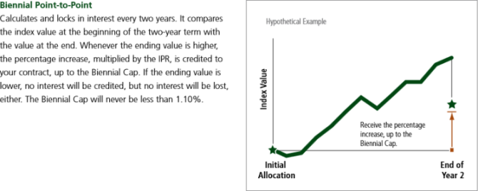
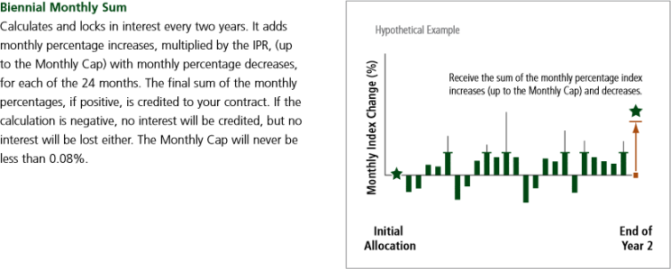

## Fixed Annuities

* Fixed Index Annuities have always been a staple of Financial Planners
* Incredibly easy to understand and explain, just pays a fixed interest rate
* However, in hindsight that interest rate is almost worse than other instruments when averaged over long periods of time
* Tons of historical data available

## Fixed Index Annuities

* Using modern financial instruments, it is possible to guard against large downside risk by giving up some upside
* Fixed Index Annuities bring these methods to Life Insurance, giving some exposure to a variable rate instrument (S&P 500 Index) while guaranteeing no loss of initial premium
* The way these calculate interest rates is not intuitive and can be very hard to explain
* It's very hard to impossible to get hypothetical and historical returns through brokerages

--- .class #id 

## Examples




--- .class #id 

* Even if the calculation is simple (EX; Biennial Point to Point):

```{r}
initialAmount <- 10000;
bonusPercentage <- 0.05;
rateCap <- 0.08;
spxRates <- c(-0.2488, -0.0512, 0.1264, 0.1232); #Rates starting 1/3/2000

#The minimum return over a period is 0%
spxRates <- sapply(spxRates, function(x) { max(0, x)});
#The maximum return over a period is the cap.
spxRates <- sapply(spxRates, function(x) { min(rateCap, x)});

initialAmount * (1+bonusPercentage) * prod(1+spxRates)
```

* Data lookup is tedious, calculating a bunch of individual points by hand hides micro behavior, and distribution of results can be very non-intuitive!
* Even worse for models like Monthly Sum.  Much more complex models exist as well.

--- .class #id 

## Our part of the solution

* Using historical data, determine a fixed interest rate policy that would have yielded an equivalent return
* Present the distribution of these rates over time to give a sense of how these products behave in various market states
* Using the above two tools, one can begin to build an intuition about how these products behave in various market states to make educated purchasing decisions

## The First Step

* Biennial Point-to-Point model fully implemented and parameterized for Simple Premium Lump Sum policies.
* Historical data going back to 1970 to build models upon

## The Future

* More models and more complex annuitization and funding strategies